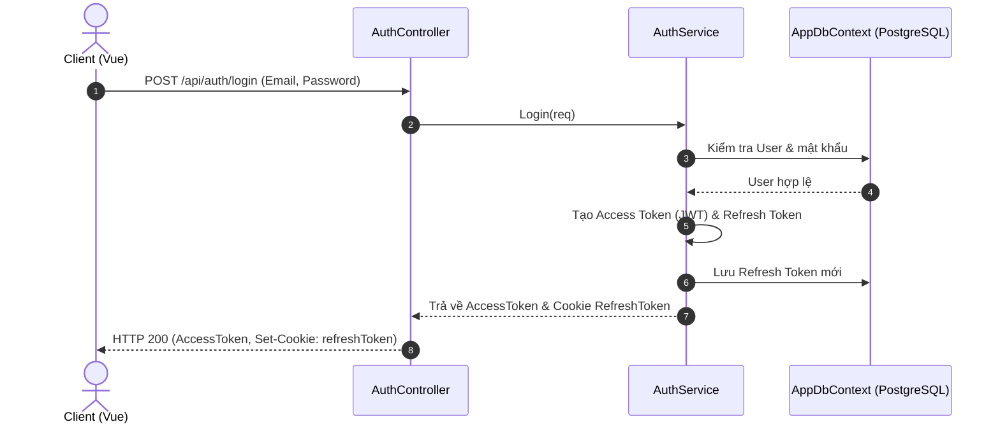

# Project Context: TaskFlow Pro (Todo List Web App)

Tài liệu này cung cấp cái nhìn tổng quan về kiến trúc, cấu trúc thư mục, mô hình cơ sở dữ liệu, cơ chế phân quyền và cách thiết lập/khởi chạy dự án **TaskFlow Pro** (ứng dụng quản lý công việc và dự án cộng tác theo mô hình Kanban).

---

## 1. Tổng quan dự án (Overview)

**TaskFlow Pro** là một ứng dụng web cho phép người dùng quản lý công việc cá nhân và cộng tác nhóm thông qua các dự án (Projects). 
- **Người dùng cá nhân**: Đăng ký, đăng nhập và quản lý công việc của riêng mình.
- **Cộng tác nhóm**: Người dùng có thể tạo dự án, mời các thành viên khác tham gia dự án bằng email, gán vai trò tương ứng và giao việc cho thành viên trong dự án.
- **Bảng Kanban**: Hiển thị trạng thái các công việc (`ToDo`, `InProgress`, `Done`, `Closed`) trực quan, hỗ trợ kéo thả hoặc thay đổi trạng thái nhanh.

---

## 2. Kiến trúc & Công nghệ (Tech Stack)

Dự án áp dụng mô hình client-server tách biệt giữa Frontend và Backend:

### Backend (API) - Có 2 phiên bản:
#### Phiên bản C# (API_v2 - Mặc định hiện tại)
- **Framework**: ASP.NET Core Web API trên nền .NET 10.0.
- **Ngôn ngữ**: C#.
- **Database Access / ORM**: Entity Framework Core kết nối PostgreSQL.
- **Xác thực & Bảo mật (Authentication & Security)**: JWT Bearer Authentication middleware tích hợp sẵn.
- **Tài liệu hóa API (API Documentation)**: Tích hợp Scalar OpenAPI ([Scalar.AspNetCore](https://github.com/scalar/scalar)).
- **Logging**: Serilog ghi log chi tiết cấu trúc ra Console và File.

#### Phiên bản Legacy VB.NET (API)
- **Framework**: ASP.NET Web API 2 trên nền .NET Framework 4.8.
- **Ngôn ngữ**: Visual Basic .NET (VB.NET).
- **Dependency Injection**: [AutofacConfig.vb](file:///d:/WebApp/todo_list/API/API/App_Start/AutofacConfig.vb) (Autofac.WebApi).
- **ORM / Database Access**: Entity Framework 6 (EF6) tích hợp [Npgsql](file:///d:/WebApp/todo_list/API/API/Web.config#L117) kết nối PostgreSQL.
- **Authentication & Security**: OWIN Middleware tự tạo sử dụng JWT Bearer Token ([Startup.vb](file:///d:/WebApp/todo_list/API/API/App_Start/Startup.vb)).
- **Logging & Middleware**: Ghi log lỗi bằng [LogHelper.vb](file:///d:/WebApp/todo_list/API/API/helpers/LogHelper.vb) và [LoggingMiddleware.vb](file:///d:/WebApp/todo_list/API/API/helpers/LoggingMiddleware.vb).

### Frontend (interface)
- **Framework**: Vue 3 (Composition API, `<script setup>`).
- **Build Tool**: Vite ([vite.config.js](file:///d:/WebApp/todo_list/interface/vite.config.js)).
- **Routing**: Vue Router 4 ([index.js](file:///d:/WebApp/todo_list/interface/src/router/index.js)).
- **UI Framework**: Bootstrap 5 + Bootstrap Icons.
- **Tùy biến giao diện (Style Customization)**: Sử dụng CSS variables toàn cục thông qua [style.css](file:///d:/WebApp/todo_list/interface/src/style.css) để cấu hình chế độ tối tùy chỉnh (Slate-Navy palette), thanh cuộn và các hiệu ứng chuyển đổi giao diện mượt mà.
- **HTTP Client**: Axios ([axios.js](file:///d:/WebApp/todo_list/interface/src/api/axios.js)) với cơ chế tự động refresh token qua Interceptor.
- **Notification & Alerts**: SweetAlert2 ([swal.js](file:///d:/WebApp/todo_list/interface/src/utils/swal.js)) được tinh chỉnh CSS variables để tự động đổi màu theo thuộc tính của thẻ `html`.
- **State Management**: Pinia Store ([projectStore.js](file:///d:/WebApp/todo_list/interface/src/stores/projectStore.js)) quản lý trạng thái xác thực (token), dự án đang chọn và vai trò của người dùng hiện tại một cách reactive.

---

## 3. Cấu trúc thư mục (Directory Structure)

Thư mục gốc chứa 3 phần chính: `API_v2` (Backend C# mới), `API` (Backend VB.NET cũ) và `interface` (Frontend).

```
todo_list/
├── API_v2/                              # ASP.NET Core Web API (.NET 10 C# Backend - Mặc định)
│   ├── Controllers/                     # API Endpoints
│   ├── Datas/                           # Entity Framework Core DbContext
│   ├── Helpers/                         # Các lớp tiện ích bổ trợ
│   ├── Middleware/                      # Custom Middlewares (Logging, CorrelationId, Exception)
│   ├── Models/                          # Định nghĩa thực thể Database & DTOs
│   ├── Repositorys/                     # Repository Pattern xử lý truy vấn DB
│   ├── Services/                        # Lớp xử lý logic nghiệp vụ
│   ├── Program.cs                       # File cấu hình khởi chạy ứng dụng
│   └── appsettings.json                 # File cấu hình database connection và JWT
│
├── API/                                 # ASP.NET Web API (VB.NET Backend - Legacy)
│   ├── API.sln                          # Visual Studio Solution File
│   └── API/                             # Source code dự án API VB.NET
│       ├── App_Start/                   # Đăng ký cấu hình hệ thống
│       │   ├── AutofacConfig.vb         # Cấu hình Dependency Injection (Autofac)
│       │   ├── Startup.vb               # Cấu hình OWIN & JWT Bearer Authentication
│       │   └── WebApiConfig.vb          # Cấu hình route API và JSON Formatter
│       ├── Controllers/                 # API Endpoints
│       ├── Datas/                       # Tương tác Cơ sở dữ liệu
│       ├── Helpers/                     # Middleware và Attributes bổ trợ
│       ├── Migrations/                  # Lịch sử Database Migrations
│       ├── Models/                      # Định nghĩa thực thể Database & DTOs
│       ├── repositorys/                 # Lớp truy vấn dữ liệu (Repository Pattern)
│       └── services/                    # Lớp xử lý logic nghiệp vụ (Service Pattern)
│
└── interface/                           # Vue 3 Frontend (Vite)
    ├── package.json                     # Danh sách dependencies & scripts
    ├── vite.config.js                   # Cấu hình build Vite
    ├── index.html                       # File HTML gốc của Single Page App
    └── src/
        ├── main.js                      # Điểm khởi chạy của ứng dụng Vue
        ├── App.vue                      # Layout chính (Sidebar + Topbar + Main Viewport)
        ├── api/
        │   └── axios.js                 # Axios Client & Interceptor (Quản lý JWT Access/Refresh Token)
        ├── router/
        │   └── index.js                 # Định tuyến Client-side & Middleware bảo mật route
        ├── stores/
        │   └── projectStore.js          # Pinia store quản lý phiên đăng nhập và thông tin dự án
        ├── utils/
        │   └── swal.js                  # Wrapper cho SweetAlert2 hiển thị thông báo
        ├── Services/                    # Gọi API từ Frontend sang Backend
        │   ├── authService.js
        │   ├── projectService.js
        │   └── taskService.js
        └── views/                       # Giao diện người dùng
            ├── DashboardView.vue        # Trang chủ thống kê tiến độ chung
            ├── LoginView.vue            # Trang đăng nhập
            ├── RegisterView.vue         # Trang đăng ký
            ├── ProjectsView.vue         # Giao diện quản lý danh sách dự án
            ├── TaskView.vue             # Bảng Kanban kéo thả công việc
            └── SettingsView.vue         # Trang cài đặt cá nhân
```

---

## 4. Mô hình Cơ sở dữ liệu (Database Schema)

Cơ sở dữ liệu PostgreSQL sử dụng các thực thể được quản lý bởi Entity Framework 6 Code First thông qua [AppDbContext.vb](file:///d:/WebApp/todo_list/API/API/Datas/AppDbContext.vb).

### Danh sách các bảng
1. **Users** (`User`): Lưu trữ thông tin tài khoản người dùng.
   - `Id` (Guid, Primary Key)
   - `Email` (String, Unique)
   - `PasswordHash` (String)
   - `IsActive` (Boolean)
   - `CreatedAt` (DateTime)
2. **Projects** (`Project`): Lưu trữ thông tin dự án.
   - `Id` (Guid, Primary Key)
   - `Name` (String)
   - `Description` (String, Nullable)
   - `OwnerId` (Guid, Foreign Key -> `Users.Id`)
   - `CreatedAt` (DateTime)
   - `UpdatedAt` (DateTime)
3. **ProjectMembers** (`ProjectMember`): Bảng liên kết nhiều-nhiều giữa User và Project xác định vai trò của thành viên trong dự án.
   - `Id` (Guid, Primary Key)
   - `ProjectId` (Guid, Foreign Key -> `Projects.Id`)
   - `UserId` (Guid, Foreign Key -> `Users.Id`)
   - `Role` (String: `Owner`, `Editor`, `Viewer`)
   - `JoinedAt` (DateTime)
4. **TodoTasks** (`TodoTask`): Danh sách công việc của dự án hoặc công việc cá nhân.
   - `Id` (Integer, Primary Key Identity)
   - `Title` (String)
   - `Description` (String, Nullable)
   - `CreatedAt` (DateTime)
   - `Deadline` (DateTime, Nullable)
   - `Status` (Enum `TaskStatus`: `ToDo` = 0, `InProgress` = 1, `Done` = 2, `Closed` = 3)
   - `CreatorId` (Guid, Foreign Key -> `Users.Id`)
   - `ProjectId` (Guid, Foreign Key -> `Projects.Id`, Nullable)
5. **TaskAssignments** (`TaskAssignment`): Thành viên được giao việc trong một Task.
   - `TaskId` (Integer, Composite Primary Key -> `TodoTasks.Id`)
   - `UserId` (Guid, Composite Primary Key -> `Users.Id`)
   - `CanView` (Boolean)
   - `CanEdit` (Boolean)
   - `AssignedAt` (DateTime)
6. **RefreshTokens** (`RefreshToken`): Quản lý phiên đăng nhập và làm mới Access Token.
   - `Id` (Guid, Primary Key)
   - `UserId` (Guid, Foreign Key -> `Users.Id`)
   - `Token` (String, Unique)
   - `CreatedAt` (DateTime)
   - `ExpiresAt` (DateTime)
   - `RevokedAt` (DateTime, Nullable)

---

## 5. Cơ chế Bảo mật & Phân quyền (Security & RBAC)

### Xác thực thông qua JWT (JSON Web Token)
- **Access Token**: Có thời hạn ngắn (cấu hình trong [Web.config](file:///d:/WebApp/todo_list/API/API/Web.config#L20)), được trả về trực tiếp trong payload JSON khi đăng nhập thành công. Giao diện lưu trữ token này trong `localStorage` và gửi kèm trong header `Authorization: Bearer <Token>` cho mỗi request.
- **Refresh Token**: Có thời hạn dài (30 ngày), được gửi qua cookie `HttpOnly` bảo mật chống tấn công XSS. Khi Access Token hết hạn (Lỗi HTTP 401), interceptor của [axios.js](file:///d:/WebApp/todo_list/interface/src/api/axios.js#L33) trên client sẽ tự động gọi endpoint `/api/auth/refresh` để nhận một Access Token mới mà không bắt người dùng đăng nhập lại.

### Phân quyền dựa trên vai trò trong dự án (Project RBAC)
Lớp lọc tùy chỉnh [ProjectAuthorizeAttribute.vb](file:///d:/WebApp/todo_list/API/API/helpers/ProjectAuthorizeAttribute.vb) chặn các request vào tài nguyên của dự án và kiểm tra:
1. Xác định `projectId` từ Route hoặc Query parameter.
2. Kiểm tra tài khoản hiện tại có thuộc bảng `ProjectMembers` của dự án đó không.
3. Kiểm tra vai trò của thành viên (`Role`) có nằm trong danh sách các vai trò được phép thực hiện hành động này không:
   - **`Owner`**: Người tạo dự án. Có toàn quyền quản lý thông tin dự án, xóa dự án, thêm/sửa đổi/xóa thành viên và phân quyền thành viên.
   - **`Editor`**: Thành viên tham gia có quyền tạo công việc, chỉnh sửa công việc và cập nhật trạng thái bảng Kanban.
   - **`Viewer`**: Thành viên chỉ có quyền xem chi tiết dự án và công việc trong dự án, không thể chỉnh sửa hay tạo mới.

---

## 6. Giao diện sáng/tối & Đa ngôn ngữ (UI Theme & Internationalization)

### Chế độ Tối (Dark Mode)
Ứng dụng tích hợp chế độ tối cao cấp (Premium Slate-Navy Theme) đồng bộ toàn diện trên tất cả các màn hình, thẻ công việc, bảng Kanban, danh sách thành viên và các hộp thoại pop-up:
- **Nền ứng dụng chính**: `#0b0f19` (Deep Slate-Navy).
- **Thẻ (Cards), Sidebar & Header**: `#111827` (Sleek Dark Slate).
- **Viền phân cách (Borders)**: `#1e293b` (Slate-Blue).
- **Văn bản & Tiêu đề**: Màu trắng sữa (`#f8fafc`) và xám sáng (`#cbd5e1`) đảm bảo độ tương phản cao chống mỏi mắt.
- **Đồng bộ hệ điều hành**: Tự động phát hiện tùy chọn giao diện của hệ thống (OS preferences) qua `prefers-color-scheme` khi người dùng chưa thiết lập thủ công.
- **Hộp thoại SweetAlert2**: Được ghi đè hoàn toàn bằng CSS variables tương ứng để thay đổi nền, tiêu đề và nút bấm theo giao diện hiện tại.

### Ngôn ngữ (Language)
Toàn bộ dự án đã được chuyển đổi từ tiếng Việt sang tiếng Anh (`en-US`):
- **API Backend**: Toàn bộ chuỗi thông báo lỗi (Exceptions) và thông báo thành công từ Controller/Service được cấu hình bằng tiếng Anh. Các thông báo ràng buộc hợp lệ dữ liệu (như `Register.vb` validation constraints) được dịch hoàn chỉnh.
- **Giao diện Client**: Tiêu đề trang, nút bấm, hướng dẫn biểu mẫu, ngày tháng hiển thị theo định dạng `en-US` và các dòng cảnh báo đều được Việt hóa chuyển sang Tiếng Anh hoàn toàn.

---

## 7. Danh sách API Endpoints chính

### Xác thực & Người dùng (`/api/auth`)
- `POST /api/auth/register` (AllowAnonymous): Đăng ký tài khoản mới.
- `POST /api/auth/login` (AllowAnonymous): Đăng nhập, trả về Access Token trong body và thiết lập cookie Refresh Token.
- `POST /api/auth/refresh` (AllowAnonymous): Làm mới Access Token thông qua cookie Refresh Token.
- `POST /api/auth/logout`: Đăng xuất và vô hiệu hóa token hiện tại.
- `GET /api/auth/search?q={keyword}`: Tìm kiếm người dùng theo email (dùng khi mời thành viên mới).

### Quản lý Dự án (`/api/projects`)
- `GET /api/projects`: Lấy danh sách dự án mà người dùng tham gia.
- `POST /api/projects`: Tạo dự án mới (Người tạo tự động trở thành `Owner`).
- `GET /api/projects/{projectId}` (ProjectAuthorize): Xem chi tiết dự án.
- `PUT /api/projects/{projectId}` (ProjectAuthorize("Owner")): Cập nhật thông tin dự án.
- `DELETE /api/projects/{projectId}` (ProjectAuthorize("Owner")): Xóa dự án (chỉ Owner thực sự mới được phép).

### Quản lý Thành viên Dự án (`/api/projects/{projectId}/members`)
- `GET /api/projects/{projectId}/members` (ProjectAuthorize): Xem danh sách thành viên dự án.
- `POST /api/projects/{projectId}/members` (ProjectAuthorize("Owner")): Thêm thành viên vào dự án với vai trò (`Owner`, `Editor`, `Viewer`).
- `PUT /api/projects/{projectId}/members/{userId}` (ProjectAuthorize("Owner")): Cập nhật vai trò của thành viên.
- `DELETE /api/projects/{projectId}/members/{userId}` (ProjectAuthorize("Owner")): Xóa thành viên khỏi dự án.

### Quản lý Công việc trong Dự án (`/api/projects/{projectId}/tasks` hoặc `/api/tasks`)
- `GET /api/projects/{projectId}/tasks` (ProjectAuthorize): Lấy toàn bộ công việc thuộc dự án.
- `POST /api/projects/{projectId}/tasks` (ProjectAuthorize("Owner", "Editor")): Tạo công việc mới trong dự án.
- `PUT /api/tasks`: Cập nhật chi tiết công việc (tiêu đề, mô tả, deadline, trạng thái).
- `DELETE /api/tasks/{id}`: Xóa công việc.
- `POST /api/tasks/assign`: Giao công việc cho một thành viên kèm quyền hạn (`CanView`, `CanEdit`).
- `PUT /api/tasks/assign`: Cập nhật quyền hạn của người được giao.
- `DELETE /api/tasks/assign`: Hủy giao việc.
- `PUT /api/tasks/status`: Cập nhật trạng thái công việc (dùng khi kéo thả Kanban).

---

## 8. Các luồng xử lý chính (Key Flows)



---

## 9. Hướng dẫn thiết lập & Khởi chạy dự án (Setup Guide)

### Yêu cầu tiên quyết (Prerequisites)
- **Hệ điều hành**: Windows (để chạy tốt nhất với cả .NET Core và .NET Framework 4.8).
- **IDE**: Visual Studio 2022 hoặc VS Code / Rider.
- **Database**: PostgreSQL 12 trở lên (chạy cục bộ ở cổng `5432`).
- **Runtime**: Node.js v18 trở lên + npm.

### Khởi chạy Backend C# (API_v2 - Mặc định)
1. **Thiết lập database**:
   - Đảm bảo PostgreSQL đang chạy.
   - Tạo một database trống tên là `todo_list`.
   - Kiểm tra kết nối trong file [appsettings.json](file:///d:/WebApp/todo_list/API_v2/appsettings.json#L5) ở chuỗi `ConnectionStrings.PostgresConnection`.
2. **Khởi chạy Migration**:
   - Mở terminal tại thư mục `API_v2` và chạy lệnh cập nhật database:
     ```bash
     dotnet ef database update
     ```
3. **Chạy ứng dụng API**:
   - Chạy lệnh khởi chạy:
     ```bash
     dotnet run
     ```
   - API mặc định chạy ở cổng: `https://localhost:7087` (và `http://localhost:5151`). Cổng này đã được thiết lập sẵn trong [.env](file:///d:/WebApp/todo_list/interface/.env) của Frontend.
   - Bạn có thể xem tài liệu Scalar OpenAPI tại địa chỉ: `https://localhost:7087/scalar/v1`.

### Khởi chạy Backend VB.NET (API - Legacy)
1. **Thiết lập database**:
   - Tạo một database trống tên là `todo_listt`.
   - Kiểm tra kết nối trong file [Web.config](file:///d:/WebApp/todo_list/API/API/Web.config#L117) ở chuỗi `PostgresConnection`.
2. **Restore Packages & Run Migrations**:
   - Mở file [API.sln](file:///d:/WebApp/todo_list/API/API.sln) bằng Visual Studio.
   - Mở cửa sổ **Package Manager Console** (`Tools > NuGet Package Manager > Package Manager Console`).
   - Chạy lệnh `Update-Database`.
3. **Chạy API**:
   - Bấm **F5** hoặc **Start** trên Visual Studio để khởi chạy IIS Express.
   - API chạy ở cổng: `https://localhost:44355`.

### Khởi chạy Frontend (interface)
1. **Di chuyển vào thư mục interface**:
   - Mở terminal tại thư mục `interface`.
2. **Cài đặt thư viện**:
   ```bash
   npm install
   ```
3. **Khởi chạy máy chủ phát triển**:
   ```bash
   npm run dev
   ```
   - Ứng dụng client mặc định chạy ở địa chỉ `http://localhost:5173`.
4. **Kiểm tra kết nối**:
   - Đảm bảo giá trị `VITE_API_BASE_URL` trong [interface/.env](file:///d:/WebApp/todo_list/interface/.env) khớp với cổng API mà bạn đang chạy (Ví dụ: `https://localhost:7087/api` cho API C# hoặc `https://localhost:44355/api` cho API VB.NET).
